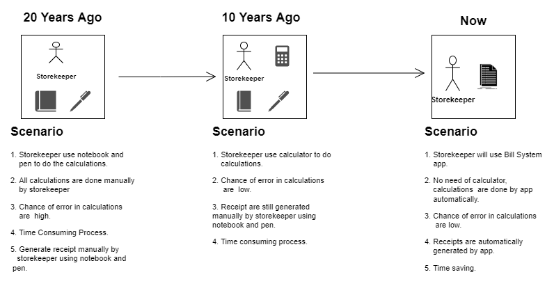

# Requirements

---

## Features

---

- Generates the invoices by just inserting the items, quantity and unit price.
- No need of calculator as it is capable of doing all operation that are required to generate invoce.
- Saves time, as it can do calculations and generate invoice simultaneously.

## State of Art

---

## 4W and 1H

---

### What

Application that designed to be implemented in local Grocery store or shops. It will helps user to generate invoices for cutomers and also helps in doing calculations.

### Why

As we know when we go in our local grocery store or shops then grocer or shopkeeper just gives item and do calculations on calculator and if customer want receipt then they just write all the item's data on a piece of paper and handover it to the cutomer, as this process is time consuming and gives burden to grocer or shopkeeper, so this application can overcome all these problems.

### Where

This application can be implement in local grocery store or shops.

### How

Billing System is an application that will take input from user such as customer details and item details and then it will do all the calculations internally that are required and generate an invoice with customer name and total amount.

## SWOT Analysis

---

#### Strengths

- Saves Time
- Automatic Calculations
- No chance of errors in calculations of inputs are right
- Feature to add GST or give Discount

#### Weaknesses

- Cannot came back, once forward to next step

#### Opportunities

- Can be implemented in any type of store or shops

#### Threats

- Other Similar Applications

## High Level Requirements

---

| HLR   | Description                                                                                | Status      |
| ----- | ------------------------------------------------------------------------------------------ | ----------- |
| HLR_1 | App will able to do the all calculations that are required to generate bill amount         | Implemented |
| HLR_2 | Amount of discount and GST will be added to the total amount of bill after calculations    | Implemented |
| HLR_3 | App will able to generate the Bill Invoice which contains cutomer details and item details | Implemented |
| HLR_4 | App will able to save the generated invoice if storekeeper wants to save it                | Implemented |
| HLR_5 | App will able to search the invoice of a particular item from the saved invoices           | Implemented |

## Low Level Requirements

---

| LLR HLR_1   | Description                                                                          | Status      |
| ----------- | ------------------------------------------------------------------------------------ | ----------- |
| LLR_1 HLR_1 | Get data from standard input                                                         | Implemented |
| LLR_2 HLR_1 | Compute the data by doing appropriate operations and pass it to appropriate function | Implemented |
| LLR_3 HLR_1 | Return the amount after doing the caculations                                        | Implemented |

| LLR HLR_2   | Description                                                        | Status      |
| ----------- | ------------------------------------------------------------------ | ----------- |
| LLR_1 HLR_2 | Deduct the discount amount and add GST amount to final bill amount | Implemented |
| LLR_2 HLR_2 | Return the final amount                                            | Implemented |

| LLR HLR_4   | Description                                            | Status      |
| ----------- | ------------------------------------------------------ | ----------- |
| LLR_1 HLR_4 | Open the file or create file if no file created before | Implemented |
| LLR_2 HLR_4 | Write the invoice details into the file                | Implemented |
| LLR_2 HLR_4 | Return the file pointer and close the file             | Implemented |
