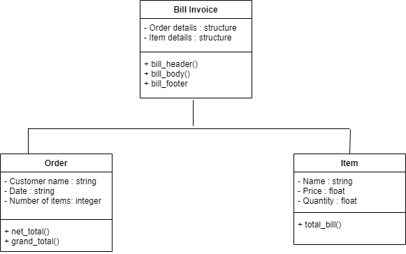
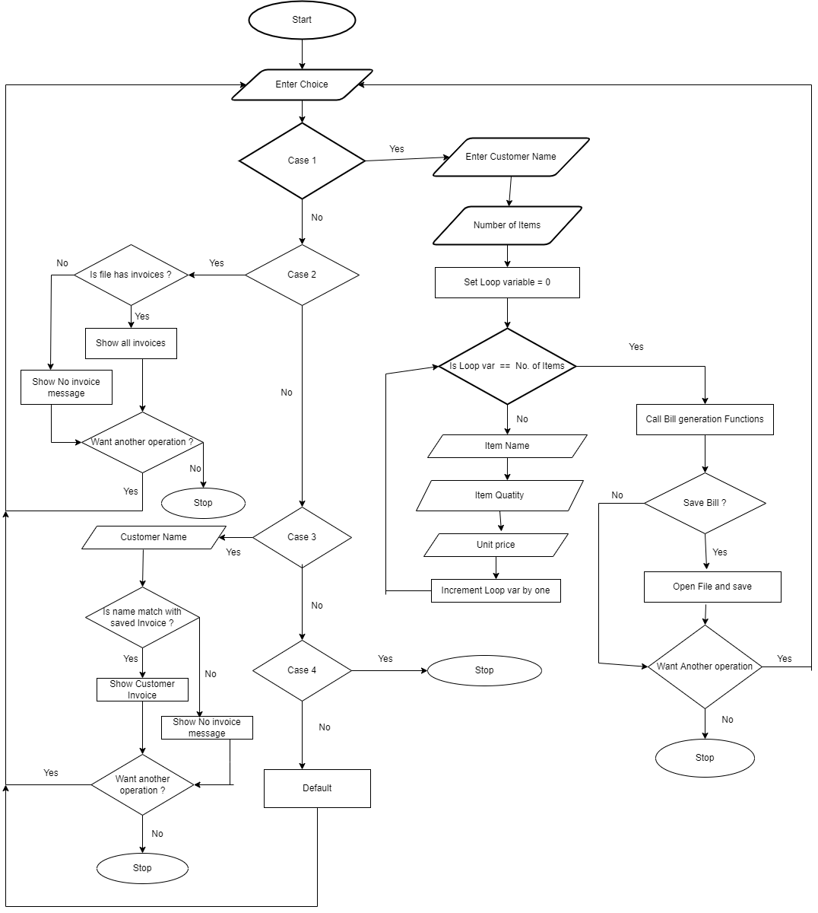

# Report

## Billing System App

---

Billing System is an application designed to generate the bill invoice to the customer which can be used in any departmental store, shops , cafe etc. It can be capable of doing the all caculations so there is no need of separate caculator.
However this application is specially designed for the local Grocery Store.

# Requirements

---

## Features

---

- Generates the invoices by just inserting the items, quantity and unit price.
- No need of calculator as it is capable of doing all operation that are required to generate invoce.
- Saves time, as it can do calculations and generate invoice simultaneously.

## State of Art

---

## 4W and 1H

---

### What

Application that designed to be implemented in local Grocery store or shops. It will helps user to generate invoices for cutomers and also helps in doing calculations.

### Why

As we know when we go in our local grocery store or shops then grocer or shopkeeper just gives item and do calculations on calculator and if customer want receipt then they just write all the item's data on a piece of paper and handover it to the cutomer, as this process is time consuming and gives burden to grocer or shopkeeper, so this application can overcome all these problems.

### Where

This application can be implement in local grocery store or shops.

### How

Billing System is an application that will take input from user such as customer details and item details and then it will do all the calculations internally that are required and generate an invoice with customer name and total amount.

## SWOT Analysis

---

#### Strengths

- Saves Time
- Automatic Calculations
- No chance of errors in calculations of inputs are right
- Feature to add GST or give Discount

#### Weaknesses

- Cannot came back, once forward to next step

#### Opportunities

- Can be implemented in any type of store or shops

#### Threats

- Other Similar Applications

## High Level Requirements

---

| HLR   | Description                                                                                | Status      |
| ----- | ------------------------------------------------------------------------------------------ | ----------- |
| HLR_1 | App will able to do the all calculations that are required to generate bill amount         | Implemented |
| HLR_2 | Amount of discount and GST will be added to the total amount of bill after calculations    | Implemented |
| HLR_3 | App will able to generate the Bill Invoice which contains cutomer details and item details | Implemented |
| HLR_4 | App will able to save the generated invoice if storekeeper wants to save it                | Implemented |
| HLR_5 | App will able to search the invoice of a particular item from the saved invoices           | Implemented |

## Low Level Requirements

---

| LLR HLR_1   | Description                                                                          | Status      |
| ----------- | ------------------------------------------------------------------------------------ | ----------- |
| LLR_1 HLR_1 | Get data from standard input                                                         | Implemented |
| LLR_2 HLR_1 | Compute the data by doing appropriate operations and pass it to appropriate function | Implemented |
| LLR_3 HLR_1 | Return the amount after doing the caculations                                        | Implemented |

| LLR HLR_2   | Description                                                        | Status      |
| ----------- | ------------------------------------------------------------------ | ----------- |
| LLR_1 HLR_2 | Deduct the discount amount and add GST amount to final bill amount | Implemented |
| LLR_2 HLR_2 | Return the final amount                                            | Implemented |

| LLR HLR_4   | Description                                            | Status      |
| ----------- | ------------------------------------------------------ | ----------- |
| LLR_1 HLR_4 | Open the file or create file if no file created before | Implemented |
| LLR_2 HLR_4 | Write the invoice details into the file                | Implemented |
| LLR_2 HLR_4 | Return the file pointer and close the file             | Implemented |

# Design

---

## Structure Diagram

### 1. Component Diagram

---

### 2. Class Diagram

---

## Behaviour Diagram

### 1. Activity Daigram

---

### 2. Communication Diagram

---

# Implementation

## Manual

### Setup to run Project

- An integrated development environment (Suggesting Visual Studio Code).
- GCC compiler to compile the project.
- "make" to run the Makefile smoothly.

### Steps To run Project

1. First clone the repository from the Github.
2. Open the repository in an IDE (Suggesting Visual Studio Code).
3. The next step is to build the project with the help of make command :
   - make all
4. Next step is to run the project with help of make command :
   - make run
5. If you want to run the test cases then run the following command :
   - make test
6. Clean all executable files by following command :
   - make clean

# Test Plan

---

## High Level Test Plan

---

| TestID | Description                                                                                                                                  | Exp I/P | Exp O/P                       | Actual O/P                    | Type of Test      |
| ------ | -------------------------------------------------------------------------------------------------------------------------------------------- | ------- | ----------------------------- | ----------------------------- | ----------------- |
| H_01   | Calculating Total Bill i.e deducting 10% discount from bill and adding 18% to bill and then return the Total amount of bill                  | 140     | 165.2                         | 165.2                         | Requirement Based |
| H_02   | Generating Invoice with Customer name                                                                                                        | ----    | SUCCESS                       | SUCCESS                       | Requirement Based |
| H_03   | When user enter option which is not listed                                                                                                   | ----    | Give message "Invalid option" | Give message "Invalid option" | Scenario Based    |
| H_04   | When no saved invoices to show                                                                                                               | ----    | Show no invoice message       | Show no invoice message       | Boundary based    |
| H_05   | Saving the generated invoice in file with cutomer name                                                                                       | ----    | SUCCESS                       | SUCCESS                       | Requirement Based |
| H_06   | Handeled Negative values, when user accidently give negative values of item quntity or item price , then app simply return '0' as total bill | ----    | SUCCESS                       | SUCCESS                       | Requirement Based |

## Low Level Test Plan

---

| TestID | Description                                                                                 | Exp I/P       | Exp O/P                  | Actual O/P               | Type of Test      |
| ------ | ------------------------------------------------------------------------------------------- | ------------- | ------------------------ | ------------------------ | ----------------- |
| L_01   | Calculating Particular Item Bill by taking item quantiy and unit price as input             | 5 , 27        | 135                      | 135                      | Requirement Based |
| L_02   | Calculating Bill with 10% Discount, taking bill amount as input                             | 135           | 121.5                    | 121.5                    | Requirement Based |
| L_03   | Calculating Bill with 18% GST                                                               | 121.5         | 143.37                   | 143.37                   | Requirement Based |
| L_04   | Search Invoice, take customer name as input and return the invoice related to that customer | Customer Name | Customer Invoice         | Customer Invoice         | Requirement Based |
| L_05   | Search Invoice (Multiple Invoices of same Customer)                                         | Customer Name | All Invoices of Customer | All Invoices of Customer | Scenario Based    |
